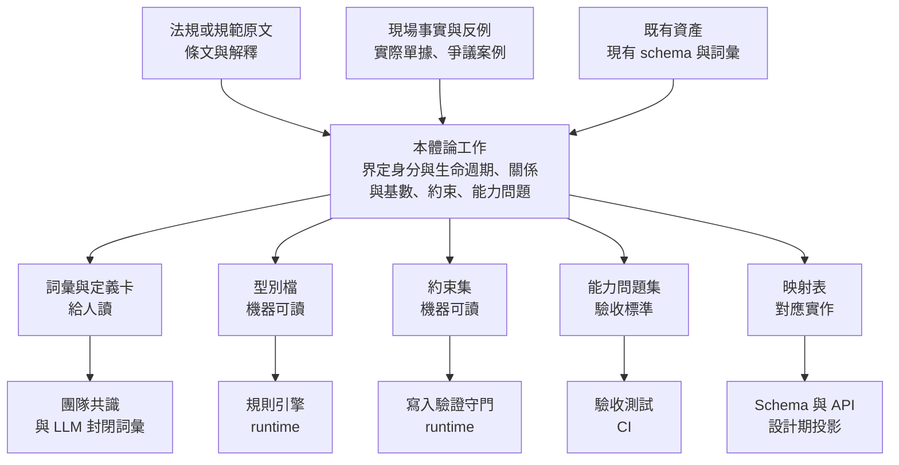

# 本體論設計指南

> **文件定位（2026-10-01 修訂）**
> - 本指南是《團隊開發流程_精簡版.md》（Domain 設計規範）的**詳細參考**：精簡版規定「每一步交什麼、怎樣算做完」，本指南說明背後的判斷準則、YAML 宣告格式與檢查工具。
> - 本指南中涉及儲存與實作的內容（例：3.1「Projection 可不可以存」、階段三點五的 L3 實作方式、各斷言範例），屬平台層級的決定，以《平台架構約定.md》為準。
> - **兩者衝突時以精簡版為準**。精簡版已納入對抗性審查的決定（見《團隊開發流程_對抗性審查.md》）與 Sean 9/18、9/21、9/30 三場會議的內容；本指南撰寫較早，以下已逐處更正。
> - 範例都用人資請假，原則適用任何領域。

## 修訂紀錄

### 2026-10-01：依 Sean 原始材料與精簡版流程更正

| # | 更正 | 位置 | 理由 |
|---|---|---|---|
| 1 | 補上本指南與精簡版六步驟的對照，並列出本指南沒有涵蓋、須以精簡版為準的部分 | 新增 0.1 | 兩份文件的階段編號不同，容易混用 |
| 2 | 補上三種「分層」的區別：本指南的 L0／L1／L2、Sean 9/30 的 core／shared／domain、Sean 材料的 T0～T3 | 新增 0.2 | 三者都叫「層」，但切的是不同的東西 |
| 3 | 「四層不可折疊」改為「五層」：在要求與決定之間加入「建議（Proposal）」 | 階段三點五、3.3、`layer` 欄位 | Sean 9/30 的決策流程（訊號 → 證據 → 狀態 → 建議 → 人決定）；精簡版原則 3 |
| 4 | 階段三點五補上「動詞也有生命週期」：流程本身一律要有狀態機，可跳過的只有屬性更新 | 階段三點五 | Sean 9/30：「動詞跟名詞同樣都會有生命週期」 |
| 5 | 1.2「封閉世界／開放世界」的對比加註：本流程的檢查一律採封閉世界 | 1.2 | 本指南自己的 CI 斷言（例如「欄位不存在」）就是封閉世界檢查，原文容易讓人以為本體論不能做封閉檢查 |
| 6 | 1.5「能力問題來源多樣性是唯一的外部品質控制」改為與 Domain 專家、黃金案例並列 | 1.5 | 對抗性審查 M3、H3 的決定 |
| 7 | 1.6「本體論的投資報酬率跟模型能力成反比」改標為作者觀點，並並列 Sean 的相反立場 | 1.6 | 原文是推論不是事實；Sean 9/30 主張越強的 AI 越需要 Ontology 劃界（水泥牆、「AI is blocked by trust」） |
| 8 | 決定五：發現核心缺口改依精簡版的「變更等級」處理，不再推論「凍結前提不成立」 | 決定五 | 精簡版 0.2：凍結是「修改要留紀錄」，補一個關係屬第 2 級擴充 |
| 9 | 3.7 版號對應精簡版的 0～3 級 | 3.7 | 兩套等級需要一致 |
| 10 | 「假別模組」改為「假別領域」 | 第四部標題、階段一完成判準 | 避免和 Sean 反對的「分模組」混淆 |
| 11 | 補上命名規則：英文為標準名稱，中文為對照（後由 #20 修正為「模型元素用英文識別名稱、分類值用穩定代碼，各語言名稱由對照表映射」） | 階段二 | Sean 9/30 |
| 12 | **工具錯誤修正**：`check.py` 把 `struct` 型答案誤判為「走不到」；`derive.py` 沒有實作 3.4 表中的 `lifecycle.ends_when` 推導 | 附錄 A | 實際執行驗證：以 `answer_type: struct{…}` 的能力問題測試，`check.py` 回報紅燈；有 `ends_when` 的 Entity 推導不出對應不變量 |
| 13 | 註明工具只實作了 3.6 檢查條件中的一部分 | 附錄 A | 原文稱宣告「可機器檢查」，但 3.6 約 20 條檢查中工具只做了 4 條 |
| 14 | 法規相關例子加註「示意，使用前需核對原文」 | 第四部開頭 | 對抗性審查 H4 |
| 15 | 映射表（第 7 種產出）註明不屬於 Ontology、不放進 `core/` | 1.4 | 與精簡版 0.1 一致 |
| 16 | 階段一的來源要求、階段四的工具依賴、階段六的完成判準，與精簡版對齊 | 階段一、四、六 | 原文「通過或失敗都算」與精簡版「未執行 ≠ 通過、P0 須 100%」衝突 |
| 17 | 階段六的請假守恆式補上「已保留」 | 階段六 | 與精簡版 ④、Sean 材料的守恆式一致 |
| 18 | 3.2 L0 的可變性改為「擴充升 Minor、改變意思升 Major」 | 3.2 | 原文「變更需 Major」與 3.7 的對應表衝突 |
| 19 | 新增 2.1～2.4：階段串接、階段內 SOP、專家回饋通道、回頭與回歸；新增工具 `impact.py`；2.0 的「跳過階段三點五」改為只有屬性更新可跳過（2026-10-02） | 第二部、附錄 A | 精簡版新增 0.9；專家意見會在任何時間進來，需要明確的處理方式 |
| 20 | 規定分「必須／預設／建議」三種強度，數量門檻改為預設；`currently_answerable` 門檻限於改既有系統；命名區分模型元素（英文識別名稱）與分類值（穩定代碼），新增詞彙對照表 `glossary.yaml`（2026-10-02） | 階段一、階段二 | 現實運行時的衝突：門檻卡關、專家缺席、分類值誤當模型元素命名、多語言需要映射 |

---

## 0.1 與精簡版流程的對照

| 本指南 | 精簡版 | 說明 |
|---|---|---|
| 階段一　能力問題 | ① 範圍與驗收問題 | 「能力問題」＝精簡版的「驗收問題」 |
| 階段二　判定 Entity | ② 名詞盤點 | 身分準則七問 → 精簡版濃縮為三問 |
| 階段三　宣告 Relation | ② 關係清單 | |
| 階段三點五　Event 與狀態機 | ③ 流程與狀態 | 精簡版另有決策流程、正式 Use Case |
| 階段四　不變量 | ④ 規則與限制 | `authority` 類不變量＝精簡版的規則表 |
| 階段五　映射 | ⑤ 投影到實作 | 資料身分、時間欄位、規則落實位置等改依《平台架構約定》 |
| 階段六　對帳 | ⑥ 跑起來驗證 | 精簡版另要求黃金案例、專家確認、執行者與簽核者分開 |

**本指南沒有涵蓋、以精簡版為準的部分**：情境切片與切片大小（0.3）、共用核心的候選／已驗證狀態與 PR 流程（0.3）、檢查會與凍結、完整／輕量模式、特例的 0～3 級（0.2）、Domain 專家的介入點、與 AI 協作的工作習慣、挑錯角度（0.5）、黃金案例（⑥）。

**檔案格式**：精簡版的 `core/` 以 Markdown 撰寫給人審查；要使用附錄 A 的工具，需另存一份 YAML（`cq.yaml`、`core/entities.yaml`、`core/relations.yaml`、`core/state_machines.yaml`），作為 `core/` 的機器可讀版本。

## 0.2 三種「分層」不要混用

| 分層 | 出處 | 切的是什麼 | 例子 |
|---|---|---|---|
| L0／L1／L2 | 本指南 3.2 | **型別、實例、實作** | L0：`RuleVersion` 有哪些欄位；L1：勞基法某條那一筆；L2：資料表 |
| core／shared／domain | Sean 9/30、精簡版 0.3 | **概念的共用範圍** | core：Person；shared：Employment；domain：LeaveEntitlement |
| T0～T3 | Sean 材料（「回顧人資系統架構」） | **真相的來源** | T0：語意定義；T1：業務事實；T2：可重建的投影；T3：外部觀察 |

三者互相垂直：一個概念可以同時是「core、L0、T0」（例：Person 的定義），它的某筆資料則是「T1」。

---

## 目錄

**前言**
- [修訂紀錄](#修訂紀錄)
- [0.1 與精簡版流程的對照](#01-與精簡版流程的對照)
- [0.2 三種「分層」不要混用](#02-三種分層不要混用)

**第一部　本體論是什麼**
- [1.1 它解決的問題](#11-它解決的問題)
- [1.2 和資料模型的差別](#12-和資料模型的差別)
- [1.3 它做的三件事](#13-它做的三件事)
- [1.4 輸入與產出](#14-輸入與產出)
- [1.5 它不做什麼](#15-它不做什麼)
- [1.6 產出用在哪裡](#16-產出用在哪裡)
- [1.7 已知的限制](#17-已知的限制)

**第二部　SOP**
- [2.0 流程總覽](#20-流程總覽)
- [2.1 階段串接](#21-階段串接輸入產出與進入條件)
- [2.2 階段內 SOP 的細節](#22-階段內-sop-的細節)
- [2.3 專家與客戶的回饋通道](#23-專家與客戶的回饋通道)
- [2.4 回頭與回歸](#24-回頭與回歸)
- [階段一　界定能力問題](#階段一界定能力問題)
- [階段二　判定 Entity](#階段二判定-entity)
- [階段三　宣告 Relation](#階段三宣告-relation)
- [階段三點五　Event 與狀態機](#階段三點五event-與狀態機)
- [階段四　產生不變量](#階段四產生不變量)
- [階段五　建立映射](#階段五建立映射)
- [階段六　對帳](#階段六對帳)

**第三部　準則**
- [3.1 身分準則](#31-身分準則)（含：Projection 可不可以存）
- [3.2 分層準則](#32-分層準則)
- [3.3 事件與狀態準則](#33-事件與狀態準則)
- [3.4 不變量準則](#34-不變量準則)
- [3.5 完備性準則](#35-完備性準則)
- [3.6 檢查條件](#36-檢查條件)
- [3.7 變更準則](#37-變更準則)

**第四部　案例：假別領域**
- [決定一　剩餘天數是不是一個東西](#決定一剩餘天數是不是一個東西)
- [決定二　請假申請和請假事實是不是同一件事](#決定二請假申請和請假事實是不是同一件事)
- [決定三　三十天事假怎麼存](#決定三三十天事假怎麼存)
- [決定四　生理假的併入關係](#決定四生理假的併入關係)
- [決定五　誰放假](#決定五誰放假)
- [決定六　法規改了怎麼辦](#決定六法規改了怎麼辦)
- [決定七　核准這個動作是什麼](#決定七核准這個動作是什麼)
- [4.8 七個決定的回顧](#48-七個決定的回顧)

**附錄**
- [A 工具原始碼](#附錄-a工具原始碼)
- [B 假別性質檢查表](#附錄-b假別性質檢查表)

---

# 第一部　本體論是什麼

## 1.1 它解決的問題

一群人對同一個詞，意思不一樣。

這件事在三人團隊靠對話解決，在十人團隊靠文件解決，跨系統時靠介面協商解決。但這三種解法都沒有**單一真相**——對話會忘、文件會過期、介面只約定了形狀不約定意義。

於是你會看到這些症狀：

- 同一個詞在兩個 service 裡指不同東西（A 的「員工」含離職，B 的不含）
- 一個欄位的正確值只有某個資深工程師知道
- 新人問「這個 status 為什麼有這個值」，沒有人答得出來
- 需求變更時，沒有人能列出受影響的範圍

**本體論就是把「這個領域裡有哪些東西、它們之間能有什麼關係」寫成一份獨立、精確、可機器檢查的東西。**

三個形容詞都是必要的：

| 形容詞 | 意思 | 不這樣會怎樣 |
|---|---|---|
| **獨立** | 不附屬於任何一個實作、資料表或 service | 語義藏在程式碼裡，換個實作就消失 |
| **精確** | 有型別、有基數、有時間、有約束 | 只是一份詞彙表，無法驗證 |
| **可機器檢查** | 機器能判斷宣告之間有沒有矛盾、實作有沒有遵守 | 靠 review，而 review 會疲勞 |

## 1.2 和資料模型的差別

這是最常被混淆的一點，講清楚它，後面都好懂。

| | 資料模型 | 本體論 |
|---|---|---|
| 回答的問題 | 怎麼存才正確 | 這是什麼 |
| 服從於 | 儲存與查詢效率 | 領域現實 |
| 世界觀 | 封閉世界（沒記錄就是沒有） | 開放世界（沒記錄只代表不知道）※ |
| 能表達 | 什麼是允許的 | 什麼是**不可能**的 |
| 對應關係 | 一張表 | 一個概念可能對到三張表、或零張表 |

※ 這是兩種典型做法的對比，不是限制。本流程的檢查（階段六、精簡版第 ⑥ 步）一律採**封閉世界**：宣告了「必填」就必須有值、宣告了「不落地」就必須不存在。需要表達「還不知道」時，要明確宣告成一種狀態（例：Sean 9/30 簡報 MM08「Admission／Unresolved」），不能用「沒有紀錄」代替。

**最關鍵的是最後兩列。**

資料模型可以說「`leave_entitlement` 有 `balance` 欄位」。它無法說「balance 不是事實，它是推導值，所以只有重算程序能寫它」。

本體論可以說：

```
LeaveBalance 不是 Entity
  理由：刪除後可由 Accrual + Occurrence + Adjustment + Carryover + Settlement 完整還原
  後果：可以存成欄位（效能考量），但只有重算程序能寫；
        業務流程不得直接 UPDATE 它
```

這句話不是 schema，它是關於 schema 的**判斷**。而這個判斷過去只存在於某個人的腦袋裡。

### 一個具體對照

資料模型會這樣寫：

```sql
CREATE TABLE leave_entitlement (
  id UUID PRIMARY KEY,
  employment_id UUID NOT NULL,
  leave_type VARCHAR,
  days DECIMAL,
  expire_date DATE
);
```

本體論會這樣寫：

```yaml
- name: LeaveEntitlement
  definition: 因年資、事件或政策取得的請假權利
  identity_basis: 一次授予行為
  lifecycle:
    begins_when: 授予條件成立
    ends_when: 使用完畢、遞延、結算或合法失效
  not_used_for:
    - 剩餘天數（那是推導值）
    - 請假申請（那是 LeaveRequest，生命週期不同）
```

```yaml
- name: hasSource
  domain: LeaveEntitlement
  range: [LegalProvision, CompanyPolicyVersion, ContractVersion]
  cardinality: "1..1"
  rationale: 法定與公司加碼權利在全勤扣發規則上待遇不同，必須可區分
```

第二段裡沒有一個字是關於怎麼存的。但它決定了 schema 必須有一個 source 欄位——而且說得出為什麼。

## 1.3 它做的三件事

剝掉所有術語，本體論只做三件事：

### 第一件：判斷哪些東西是「東西」

有些概念有自己的身分和生命週期，有些只是屬性、狀態，或算出來的數字。

- `LeaveEntitlement` 是東西——它在某個時點成立，有自己的期限，會被引用，刪掉會遺失「這個人得到過這個權利」這個事實
- `LeaveBalance` 不是東西——它是上面那些的總和
- `pending` 不是東西——它是狀態
- `全職／兼職` 不是東西——它是分類

判斷方法見 [3.1 身分準則](#31-身分準則)。

### 第二件：判斷這些東西之間能有什麼關係

不只是「有關係」，還包括：方向、幾個對幾個、什麼時候有效、需要什麼證據、哪些組合不可能。

```
LeaveOccurrence --requestedVia--> LeaveRequest   基數 0..1
```

那個 `0` 很重要。它宣告了「請假事實可以沒有對應的申請」——員工急診當天沒來、事後補單，這是真的會發生的事。如果基數寫成 `1..1`，這個現實就無法表達，實作只能用旗標或假資料繞過去。

### 第三件：把前兩件寫成獨立的檔案

不是寫在程式碼的 if 分支裡，不是寫在 UML 圖的 note 裡，不是留在資深工程師腦袋裡。是一份可以被 diff、被查詢、被 CI 讀取的資料。

**其他所有機制——能力問題、不變量推導、分層、對帳——都只是為了讓前兩件事不變成個人品味。**

## 1.4 輸入與產出

一句話定位：**本體論是領域語義的 single source of truth。Schema、API、規則引擎、測試、LLM 詞彙都是它的投影。它自己不執行任何東西。**

### 整體位置



圖上畫的是每種產出的**主要**消費端。次要的邊沒畫，避免變成網狀：Schema 與 API 除了吃映射表，也吃型別檔（欄位型別）與約束集（DB constraint）；驗收測試也會引用型別檔。Decision Log 沒有下游消費端，它是給未來重新開啟決策的人看的。

### 輸入

全部是非結構化或半結構化的文本。這正是本體論存在的理由：把領域知識從人腦與散落的文件裡，搬到可機械處理的結構。

| 輸入 | 具體形式 |
|---|---|
| 規範原文 | 法條、標準、主管機關解釋、契約範本 |
| 現場事實 | 實際單據、作業紀錄、既有資料 |
| 反例與爭議案例 | 稽核裁罰、客訴、調解案例、內部踩過的雷 |
| 既有系統資產 | 現有 schema、程式碼裡已經在用的詞彙、例外處理碼 |

**反例特別重要，因為它是唯一能證偽定義的輸入。** 只有正面清單的輸入，產不出有約束力的本體論——它會長成一份把現況重寫一遍的文件。

### 產出

七種。分界線在於**能不能跑**。

**給人讀的（規範性文件）**

1. **受控詞彙表** — 每個詞的定義，以及明確排除什麼
2. **Entity Definition Card** — 身分、生命週期、成立與結束條件、與相似概念的差異、不應被用來表示什麼
3. **Decision Log** — 為什麼這樣切，考慮過哪些替代方案

**能跑的（可執行資產）**

4. **型別檔** — 類階層 + Relation 目錄。每條關係帶 domain、range、cardinality、inverse、有效期間。序列化成 OWL/RDF，或就是一份 YAML
5. **約束集** — 互斥、functional、必要來源、守恆律。落成 SHACL、DB constraint、或 runtime guard
6. **能力問題集** — 系統做完後必須能回答的問題，直接變成整合測試
7. **映射表** — 每個類對應到哪張表、哪支 API、哪個事件

> **如果一份「本體論」的產出只有 1 到 3，它就只是詞彙表。4 到 7 才是它跟一般設計文件的差別。**

這七種對應到第二部的六個階段：階段一產出第 6 種，階段二產出第 1、2 種，階段三產出第 4 種，階段四產出第 5 種，階段五產出第 7 種，第 3 種貫穿全程。

**注意（與精簡版一致）**：第 7 種「映射表」是精簡版第 ⑤ 步的產出（`05_mapping.md`），是投影的契約，**不放進 `core/`**；第 1～6 種才是 Ontology 本身。

---

## 1.5 它不做什麼

管理期待比推銷更重要。

| 不做 | 為什麼 |
|---|---|
| UI 設計 | 完全不相干 |
| 效能設計（索引、分庫分表） | 那是 L2 投影層的事 |
| **Service 邊界** | 語義切分與工程切分是正交的。一個 Entity 可能橫跨三個 service |
| 排程與工時估算 | 它不告訴你要做多久 |
| **發現沒有人想到的情境** | 見下 |

最後一條要展開講，因為它是最常被過度宣稱的。

本體論**不會**讓你發現沒有人想過的需求。任何流程都不會。能力問題從哪來，仍然靠人的經驗和現場接觸。

它有一個狹窄但真實的貢獻：在**已宣告的詞彙內**窮舉組合。如果「併入其他假別」這個關係已經在某個假別上被用過，工具可以逐一問其他假別「你有沒有這個關係」，問出沒有人主動檢查的格子。

但它不能發明新詞彙。一個從未被任何人說出口的概念，沒有任何檢查生得出來。

**所以外部輸入的品質，要靠流程之外的人把關。** 全部由同一個來源（同一個人、同一個模型、同一份需求文件）產生的能力問題，其盲點會原封不動傳遞到所有產出，而所有檢查都驗不出來。精簡版用三道外部把關處理這件事：

- 能力問題至少 2 種非 AI 來源，其中一種是 Domain 專家或客戶端使用者（精簡版 ①）
- Domain 專家確認範圍、規則與黃金案例（精簡版 0.5）
- 黃金案例的預期結果由獨立於系統的方式算出，不由被測系統或產出它的 AI 計算（精簡版 ⑥）

## 1.6 產出用在哪裡

本體論的產出本身不執行任何東西。它被投影到六個地方：

| 消費端 | 拿什麼 | 時機 |
|---|---|---|
| 團隊共識 | 詞彙表與定義卡 | 隨時 |
| Schema 與 API | 映射表 + 型別檔 | 設計期 |
| 規則引擎 | 型別檔（規則的 input/output 型別） | runtime |
| 寫入守門 | 約束集（DB constraint 或 service guard） | runtime |
| 驗收測試 | 能力問題 | CI |
| LLM 應用層 | 受控詞彙（把模型輸出鎖在封閉集合內） | runtime |

### 兌現的三種層級

混淆這三種，是「本體論到底怎麼運作」最常見的困惑來源：

| 層級 | runtime 有什麼 | 需要什麼模型 |
|---|---|---|
| 設計期退場 | 只有一般的表與服務 | 無 |
| 確定性查詢層 | 圖查詢、約束驗證、規則引擎 | 無 |
| 語義基底 | 模型在封閉詞彙內做映射，判斷交給符號層 | 小模型即可 |

第三層的**正確**用法不是把整份本體論塞進 context 叫模型自由推理——那是唯一真正依賴大模型、且會在地端小模型上崩掉的用法。正確用法是：使用者說一句自然語言，模型只做一件事，從已定義的 N 個類型與 M 個關係裡挑出對應項，輸出結構化的東西；判斷與計算交給下面的確定性層。

**多數系統的價值落在前兩層，而那兩層跟模型能力完全無關。**

由此得到一個反直覺的推論（**作者觀點，未經驗證**）：

> **本體論的投資報酬率，跟你手上模型的能力成反比。**
>
> 模型越強，它自己會補語義，本體論是錦上添花。
> 模型越弱，越必須把語義從模型腦袋裡搬出來變成外部符號結構，讓模型只做它做得動的那一小步。
>
> 要落地到地端小模型的系統，本體論比用雲端大模型的系統**更**需要。

**相反的立場（Sean 9/30）**：模型越強，越需要 Ontology。強模型「自己會補語義」正是風險所在：AI 擅長找「相似」，企業需要「明確」，很近不代表相同（例：Manager、Approval、Permission、Authority）。Ontology 是在 AI 的語意空間裡「建水泥牆」，讓結果可以被信任——「AI is not blocked by intelligence, it is blocked by trust」。

兩種說法其實可以並存：小模型需要本體論來**補能力**，大模型需要本體論來**建立信任**。本流程以後者為主要理由。

## 1.7 已知的限制

- 這套流程讓判斷變得**可審查**，不讓判斷變得**正確**。宣告怎麼下，仍然是判斷。
- 推導不變量的可重複性，只在宣告本身相同時成立。
- 約束是耦合。一條被多處依賴的約束，改它要驗證所有依賴方。把一個只會用到一次的規則升級成約束，是負債不是資產（判準見 [3.4](#34-不變量準則)）。
- 這份指南本身尚未被完整跑過。第四部的案例是設計出來的，不是執行紀錄。

---

# 第二部　SOP

## 2.0 流程總覽

```
階段一  能力問題 ──┐
                  ├─→ 階段二 Entity ─→ 階段三 Relation ─┐
現有實作 ─────────┘         ↑              ↑            │
                            │              │            ↓
                            │              │      階段三點五 Event 與狀態機
                            │              │            │
                            │              │            ↓
                            └──────────────┴────→ 階段四 不變量
                                （檢查紅燈時回頭）      │
                                                        ↓
                                             階段五 映射 ─→ 階段六 對帳
```

**階段三點五的深度是條件性的**，判準見[階段三點五](#階段三點五event-與狀態機)開頭的深度分級；但流程（動詞）本身一律要有狀態機，可以跳過的只有屬性更新（見修訂紀錄 #4）。

**這不是瀑布。** 檢查條件的角色是「什麼時候該回頭」的觸發器，不是最後才跑的驗收。典型的回頭有兩種：

- 階段四發現某條規則判別了 Entity 存不下的屬性 → 回階段二加欄位
- 階段三發現某條能力問題走不通 → 回階段一確認它是真需求，或回階段二補 Entity

完整的回頭與回歸規則見 2.1～2.4。

**分層（L0/L1/L2）不是第一步。** 它的判準是先驗的（見 [3.2](#32-分層準則)），但哪個概念屬於哪層，要等概念出現之後才知道。


## 2.1 階段串接：輸入、產出與進入條件

精簡版 0.9 有總表；這裡補上每個檔案在 YAML 宣告層的讀寫關係，方便用工具檢查。

| 階段 | 讀取 | 寫入 | 進入條件 |
|---|---|---|---|
| 一 | 訪談紀錄、既有 User Story、`core/` | `cq.yaml`、`questions.md` | — |
| 二 | `cq.yaml`、`core/entities.yaml` | `core/entities.yaml`（新增或變更提案） | 階段一凍結 |
| 三 | `core/entities.yaml` | `core/relations.yaml` | 階段二凍結 |
| 三點五 | `core/entities.yaml`、`core/relations.yaml` | `core/state_machines.yaml` | 階段三凍結 |
| 四 | 上述全部、法規與政策原文 | `core/invariants.derived.yaml`（工具產生）、`core/rules.yaml`（`authority_rules`） | 階段三凍結；可與三點五平行，但三點五要先凍結 |
| 五 | `core/` 全部、《平台架構約定》 | `core/mappings.yaml`（或 `05_mapping.md`）、schema、API | 階段四凍結 |
| 六 | 全部 | 斷言、測試結果、`06_evidence/` | 階段五凍結 |

**進入條件是「預設」**（精簡版 0.2）：前一步大致穩定、只剩待專家確認的項目時，可以先開始下一步，引用處標註即可。

**為什麼預設要求「前一步凍結」**：後一步引用的是前一步的內容。前一步還在變，後一步做的東西就可能白做。凍結不代表不能改，而是改的時候知道要通知誰、回歸什麼（2.4）。

## 2.2 階段內 SOP 的細節

精簡版 0.9 列出 6 個步驟。各步驟的重點：

| 步驟 | 做什麼 | 常見錯誤 |
|---|---|---|
| 1 收集輸入 | 確認讀取的檔案都已凍結（看 tag）；把預期要問專家的問題先寫進 `questions.md` | 前一步還沒凍結就開始，之後大量返工 |
| 2 AI 產初稿 | 用精簡版各步驟的提示範本；附上輸入檔案與 `core/` | 不給 `core/`，AI 重新發明已存在的名詞 |
| 3 挑錯 | 另開 session，只給產出物，依挑錯角度要求至少 5 個反例 | 在同一個 session 挑錯，AI 傾向為自己辯護 |
| 4 人修正 | 逐條處理反例：接受（修改）、拒絕（寫理由）、轉問專家 | 反例沒有逐條回應，檢查會無從判斷 |
| 5 檢查會 | 非產出者依完成標準打勾；跑 `tools/check.py` | 只靠討論，沒有對照完成標準 |
| 6 凍結 | 打 tag；②③④ 的新增項目以 PR 合併進 `core/`，狀態為「候選」 | 忘了更新 `questions.md` 中仍待確認的項目 |

第 2～4 步可以重複（發散、收斂再發散），直到第 3 步找不出新的有效反例為止。

## 2.3 專家與客戶的回饋通道

專家與客戶的意見會在任何時間進來，所以用一份清單貫穿整條切片：

```yaml
# slices/<切片>/questions.md（以 YAML 區塊記錄）
questions:
  - id: Q-EXP-003
    raised_at_stage: 2           # 在哪一步提出
    question: 兼職在兩家分店工作，特休要分開算還是合併算？
    asked_to: 人資專業人員
    status: answered             # pending | asked | answered
    answer: 分開算，各自依該分店的到職日計算年資
    answered_at: 2026-10-05
    affects: [ENT-LeaveEntitlement, REL-receivedUnder]
    action: 回到階段二，LeaveEntitlement 改為掛在 Employment（每段僱傭一份），而非 Person
```

**處理規則**

- 問題送出後不等答覆，相關項目標「待專家確認」，繼續往下做。
- 答覆進來時，對照 `affects` 列出的項目：一致就改為已確認；不一致就依精簡版 0.9 的回頭對照表，回到對應階段。
- 切片通過階段六之前，因答覆而回頭都屬第 0 級；之後則依精簡版 0.2 的第 1～3 級。
- 檢查會前，列出仍為 `pending` 或 `asked` 的問題；它們對應的項目不能升為「已驗證」。專家長期無法參與時，可由團隊暫代確認，升為「已驗證（暫代）」（精簡版 0.3）。

**例：在階段四才得到答覆**

階段二已凍結「特休掛在 Person 上」。階段四核對規則時，專家答覆「兼職跨店特休要分開算」。處理：

1. 依回頭對照表，名詞邊界錯了 → 回到階段二（第 0 級）
2. 修改 Entity 卡與關係，記一行原因（引用 Q-EXP-003）
3. 用 `tools/impact.py LeaveEntitlement` 列出受影響項目
4. 依 2.4 的回歸範圍，重新檢查階段三、四中受影響的部分，重新打勾
5. 沒受影響的階段維持原本的凍結

## 2.4 回頭與回歸

**回頭**：在哪一步發現什麼問題、要回到哪一步，見精簡版 0.9 的回頭對照表。原則是**回到造成缺口的最早一步**，不要在後面的階段加例外欄位或程式補丁繞過去。

**回歸**：回頭修改後，要重新檢查哪些東西，取決於改了什麼：

| 改了 | 要重新檢查 | 工具 |
|---|---|---|
| 能力問題 | 各階段的涵蓋度 | `check.py`（Entity 有能力問題支撐、能力問題可走到答案） |
| Entity 或 Relation | 引用它的關係、狀態機、規則、對照、能力問題；以及引用它的其他切片 | `impact.py <名稱>` 列出清單；`derive.py` 重新產生不變量並和舊版比對差異 |
| 狀態機 | Use Case、API、Use Case 測試 | `derive.py` 重新產生 |
| 規則 | 黃金案例、守恆式 | — |
| 實作 | 階段六的斷言 | CI（平台 P9） |

**跨切片的回歸**：被修改的項目若是 `core/` 中其他切片也引用的，`impact.py` 只能找出同一份宣告內的引用；其他切片的引用，要搜尋各切片的 `02_entities.md`「引用」區。這也是精簡版要求「引用候選要標註」的原因。

---

## 階段一　界定能力問題

### 為什麼有這個階段

能力問題（Competency Questions）是**唯一的需求輸入**，也是**唯一的驗收標準**。

沒有它，Entity 的數量沒有上下界——你說 134 個，別人說 40 個，沒有人能證明誰對。有了它，數量變成「這批問題需要這麼多」。

這也是判斷一份本體論是不是空話最快的方法：**問能力問題清單在哪裡**。答不出來的，那份本體論是靠直覺自證的。

### 動作

寫出系統做完之後必須能回答的問題。

```yaml
competency_questions:
  - id: CQ-nn
    question: <用業務語言寫的問題>
    subject: <這個問題問的是誰或什麼>
    answer_type: <decimal | boolean | timestamp | list<Entity> | struct>
    priority: P0 | P1
    source: <實作經驗 | 現場使用者 | 爭議案例 | 外部從業者 | 維運情境>
    currently_answerable: true | false | unknown
```

### 每個欄位的意義

| 欄位 | 為什麼需要 |
|---|---|
| `question` | 用業務語言。出現資料表名或程式變數名就是寫錯了——那代表你已經預設了答案的形狀 |
| `subject` | **最容易暴露範圍錯置的欄位。** 如果問題的主體是「人」，而你的模型把答案掛在「年度」或「組織」上，這裡會不一致 |
| `answer_type` | **它決定了模型至少要能區分什麼。** 答案型別是 `decimal`（剩幾天）和 `struct{available, carried_over}`（剩幾天、其中遞延幾天），逼出來的模型完全不同 |
| `source` | 用來檢查來源多樣性。全部同一個來源的清單，盲點會傳遞下去 |
| `currently_answerable` | 標 `false` 的那幾條才是這次工作的意義所在 |

### 完成判準

以下數量門檻皆為「預設」，偏離時在檢查會寫一行理由（精簡版 0.2「規定的強度」）。

- [ ] 數量 ≥ 8（單一情境切片）
- [ ] 改既有系統時：`currently_answerable` 非 true 的 ≥ 3（從零開始的新系統全部答不出來，此條不適用）
- [ ] `source` 種類 ≥ 3，其中至少 2 種非 AI 來源，且包含 Domain 專家或客戶端使用者（同精簡版 ①）
- [ ] 至少一條是**維運類**（「規則改了，哪些既有資料受影響」——這類最常被漏，而它決定了追溯欄位要不要存在）

### 常見卡點

**想不出「答不出來」的問題** → 代表這份清單只是現有功能的鏡子。三個找法：
1. 翻例外處理碼，每個 `if is_special` 背後都是一條沒建模的需求
2. 問「法規明天改了，我怎麼知道影響哪些人」——多數系統答不出來
3. 用領域檢查表逐格掃（假別的版本見[附錄 B](#附錄-b假別性質檢查表)）

---

## 階段二　判定 Entity

### 為什麼有這個階段

決定哪些概念值得被當成獨立的東西。做錯的兩個方向：

- **多了**：把屬性、狀態、分類、推導值都當成 Entity，模型膨脹，維護成本爆炸
- **少了**：把兩個不同生命週期的東西合成一個，現實表達不出來，實作只能用旗標繞

### 動作

對每個候選概念跑[身分準則](#31-身分準則)，通過的寫成宣告。

```yaml
entities:
  - id: ENT-nnn
    name: <正式名稱>
    parent: <上層類別>
    layer: L0
    definition: <現實世界定義，不是資料定義>
    identity_basis: <什麼行為或事實使它成為一個個體>
    lifecycle:
      begins_when: <成立條件>
      ends_when: <終止條件>
    not_used_for: [<明確排除的誤用>]
    required_by_cq: [CQ-nn]
    relations:                    # 對同輩用過的每個關係表態
      <關係名>: {<參數>}
      <關係名>: none
      <關係名>_reason: <為什麼沒有>
```

### 命名規則

模型元素（Entity、屬性、關係、事件、狀態、規則）的 `name` 用英文識別名稱，同一概念在所有檔案只用一個名稱。**分類值**（假別、保險級距、職稱這類某個分類底下的值）不是模型元素，屬於 L1 資料（見 3.2），用穩定代碼識別。

兩者的各語言名稱都由詞彙對照表映射（精簡版 ②「命名與多語對照」），YAML 格式：

```yaml
# core/glossary.yaml
terms:
  - id: LeaveEntitlement          # 模型元素：英文識別名稱
    kind: entity
    definition: 因年資、事件或政策取得的請假權利
    labels: {zh-TW: 請假權利, ja: 休暇付与}
  - id: LEAVE_TYPE.ANNUAL_TW      # 分類值：穩定代碼，帶管轄區
    kind: classification_value
    of: LeaveType
    jurisdiction: TW
    labels: {zh-TW: 特別休假}
    equivalence_note: 與日本「年次有給休暇」給假條件不同，不等價，另設 LEAVE_TYPE.ANNUAL_JP
```

`check.py` 目前不檢查詞彙對照表；可另行檢查「每個 `name` 與分類值代碼都出現在 `glossary.yaml`」。

### 兩個欄位要特別說明

**`not_used_for`**——這是整份宣告裡最容易被跳過、也最有價值的一欄。

一般文件記錄系統做什麼；這一欄記錄**這個概念不是什麼**。「LeaveEntitlement 不指剩餘天數」這句話，過去存在於資深工程師的腦袋裡，人一走就沒了。寫下來之後，新人不會再把它當成餘額用。

**`relations` 的表態**——同一個 `parent` 底下，所有子類用過的關係名稱形成「適用集」。每個子類必須對適用集的每一項明確表態。

**缺席不等於否定。** 婚假沒寫 `mergesInto`，可能是「婚假確實沒有併入關係」，也可能是「沒有人想過婚假有沒有併入關係」。這兩者的差別很重要，而只有強制表態能分辨。

這是本流程中少數能問出「沒有人主動想到的格子」的機制。

### 完成判準

- [ ] 每個 Entity 的 `required_by_cq` 非空
- [ ] 每個 Entity 通過身分準則七問
- [ ] 同 `parent` 的子類，`relations` 對適用集全部表態

---

## 階段三　宣告 Relation

### 為什麼有這個階段

Entity 清單只是名詞表。關係才讓它變成模型——而且關係的**限制**（基數、時間、證據）是後面所有不變量的來源。

### 動作

```yaml
relations:
  - id: REL-nnn
    name: <關係名>
    domain: <Entity>
    range: <Entity | [Entity, Entity]>      # list = 互斥的聯集
    inverse: <反向關係名>
    cardinality: "0..1 | 1..1 | 0..* | 1..*"
    functional: true | false
    temporal:
      valid_from: required | optional | none
      valid_to: required | optional | none
      constraint: <區間條件>
    evidence_required: [<證據類型>]
    rationale: <為什麼是這個基數、這個範圍>
    layer: L0
    enables_cq: [CQ-nn]
```

### 基數的下界是在做語義決定

`0..1` 和 `1..1` 的差別不是技術細節，是關於現實的斷言。

`LeaveOccurrence --requestedVia--> LeaveRequest` 寫成 `1..1`，等於宣告「沒有申請就沒有請假事實」。這不符合現實：員工急診當天沒來，這件事已經發生了，不因為沒有事前申請而不存在。

寫成 `0..1`，事後補單就成為模型內可表達的正常情況，而不是需要旗標繞過的例外。

**寫 `rationale` 的理由就在這裡**——基數是判斷，判斷要留下依據。

### 完成判準

- [ ] `domain` 與 `range` 都是已宣告的 Entity
- [ ] 沒有孤立 Entity（沒有任何關係連到它）
- [ ] 每個 P0 能力問題的 `subject` 能沿關係走到 `answer_type` 所需的 Entity

---

## 階段三點五　Event 與狀態機

### 為什麼有這個階段

Entity 與 Relation 描述的是「現在是什麼」。很多領域還必須回答「怎麼變成這樣的」——而這是完全不同的一組資訊。

### 先決定深度

**這個階段是條件性的。** 做過頭跟做不足一樣糟，所以先用能力問題判斷需要哪一級：

| 級 | 你需要回答的問題 | 做法 | 成本 |
|---|---|---|---|
| **L1 現況** | 現在是什麼狀態 | 狀態存成欄位，直接覆寫。**不需要這個階段** | 無 |
| **L2 軌跡** | 誰在什麼時候改成這樣、憑什麼 | 狀態仍是主資料，Event 是側寫（audit log） | 低 |
| **L3 重建** | 三年前的某一天是什麼狀態、當時依據哪版規則、錯了怎麼改而不覆蓋 | Event 是主資料，狀態由 Event 推導 | 高 |

**動詞（流程）不適用 L1**（Sean 9/30：「動詞跟名詞同樣都會有生命週期」）：凡是會隨時間推進的流程（申請、審核、結算），本身就要有狀態機。可以停在 L1 的只有屬性更新（例：改電話號碼）。

**判準來自能力問題**，不是來自技術偏好：

- 有任何一條能力問題的 `answer_type` 帶時間點（「在指定日期的⋯」）→ 至少 L2
- 有任何一條問「當時依據什麼」或「改錯了怎麼修正」→ L3
- 有法遵、金流、醫療、或任何需要舉證的場景 → L3
- 都沒有 → L1，跳過這個階段

**L3 不等於一定要 event sourcing。** 它只是說 Event 必須是不可覆寫的主資料。實作上可以是 event store，也可以是「狀態表 + 不可刪除的變更表 + 重建程序」。這個階段產出的是宣告，不是架構決策。

### 五層不可折疊

這是本階段唯一的通用硬規則，適用所有領域、所有深度級別（原為四層，2026-10-01 依 Sean 9/30 的決策流程加入 Proposal）：

```
Command  ──→  Proposal  ──→  Decision  ──→  Event  ──→  Execution
（要求）      （建議）       （判斷）      （發生）      （執行）
```

| 層 | 是什麼 | 折疊掉的後果 |
|---|---|---|
| **Command** | 有人要求做某件事 | 分不清「要求過但被拒」與「從未要求」 |
| **Proposal** | 系統或 AI 依證據與狀態提出的建議 | 分不清「AI 建議的」與「有權者決定的」；AI 的建議直接生效 |
| **Decision** | 有權者作成的判斷 | 分不清「誰批准的」與「系統自己算的」 |
| **Event** | 事情實際發生了 | 分不清「批准了」與「真的發生了」 |
| **Execution** | 對外部世界的實際動作 | 分不清「系統認為付了」與「銀行真的扣了」 |

最常見的三個折疊，以及它們的症狀：

| 折疊 | 症狀 |
|---|---|
| Decision ＝ Event | 狀態欄位直接叫 `approved`，查不到是誰批的、憑什麼 |
| Event ＝ Execution | 標記為「已付款」但銀行退匯，資料與現實不符 |
| Command ＝ Event | 事情實際發生了但沒人事先要求，系統就當它沒發生 |
| Proposal ＝ Decision | AI 建議的結果直接寫成狀態，查不到是誰同意的 |

**Command ＝ Event 最容易被忽略，而且是最貴的。** 它和 3.1 的反向誤判是同一件事——`is_backdated` 這種旗標，就是 Command 與 Event 被壓成一個的補丁。

### 動作

宣告三樣東西：狀態機、Event、更正模型。

```yaml
state_machines:
  - entity: <Entity>
    state_field: <狀態欄位名>
    states: [<狀態1>, <狀態2>, ...]
    initial: <初始狀態>
    terminal: [<終態>]
    transitions:
      - from: <狀態>
        to: <狀態>
        on: <Event 名>
        guard: <轉移前必須成立的條件>
        authority: <誰有權觸發>

events:
  - name: <Event 名>
    layer: command | proposal | decision | event | execution
    subject: <Entity>
    changes: <Entity>.<狀態欄位>      # 或 none（非狀態變更事件）
    actor_authority: <需要什麼權限>
    evidence: [<證據類型>]
    reversible_by: <Event 名 | none>
    time_semantics:
      occurred_at: required            # 現實中何時發生
      recorded_at: required            # 系統何時知道
      effective_from: optional         # 法律或規則上何時生效

correction_model:
  original_mutable: false              # 原始紀錄是否可改（L2/L3 必為 false）
  pattern: <更正如何表達>
```

### 三個欄位要特別說明

**`layer`**——每個 Event 必須標明它屬於五層的哪一層。這是唯一能機械檢查折疊的方式：若某個 Entity 的狀態同時被 `decision` 和 `event` 層的同名事件改變，那就是折疊。

**`time_semantics`**——三種時間不可混用。`occurred_at` 可以早於 `recorded_at`（遲到的事實），`effective_from` 可以晚於兩者（未來生效的規則）。只存一個時間戳的系統，無法回答任何「當時」類的能力問題。

**`reversible_by`**——填 `none` 的事件代表不可逆，那麼它的效果一旦寫入就只能用補償事件抵銷，不能撤銷。這個區分決定了更正模型長什麼樣。

### 更正模型

L2 以上必須宣告：**原始紀錄不可覆寫，更正是新的事件。**

```
OriginalEvent
  → CorrectionRequested   （Command）
  → CorrectionApproved    （Decision）
  → ReversalEvent 或 AdjustmentEvent （Event）
  → 重新推導的狀態
```

這產生一條關鍵的推導不變量：**任何狀態都必須能由事件序列解釋，不允許沒有事件的狀態跳轉。**

實務上這條最常被違反的地方是資料遷移腳本與後台修復工具——它們直接 UPDATE 狀態欄位，繞過所有事件。這是可斷言的（掃描哪些模組能寫狀態欄位）。

### 完成判準

- [ ] 每個可變狀態的 Entity 都有狀態機宣告
- [ ] 每個狀態都可由某條轉移到達（無不可達狀態）
- [ ] 每個 Event 都至少改變一個狀態，或明確標 `changes: none`（無死事件）
- [ ] 每個終態都有進入路徑，且沒有離開路徑
- [ ] 每個 Event 標了 `layer`，且同一狀態不被兩個不同 layer 的事件直接改變
- [ ] 每條 `guard` 引用的屬性，在 Entity 或 Relation 宣告中存在
- [ ] L2 以上：`original_mutable: false`，且更正模型已宣告

### 這個階段餵給階段四什麼

狀態機宣告會產生一批推導不變量：

| 宣告 | 產生的不變量 |
|---|---|
| `terminal: [X]` | X 不得再轉移到其他狀態 |
| `transitions` 全集 | 不在清單中的狀態轉移不得發生 |
| `guard` | 條件不成立時轉移不得發生 |
| `authority` | 無該權限者不得觸發 |
| `original_mutable: false` | 原始事件不得 UPDATE 或 DELETE |
| `time_semantics.occurred_at` | 重播順序依 occurred_at，不依 recorded_at |

**這就是為什麼它排在階段四之前。**

### 常見卡點

**分不清 Decision 和 Event** → 問：如果有權者批准了，但後來實際沒發生（撤回、系統失敗、對方拒絕），這兩件事要不要分開記？要 → 是兩層。

**狀態機畫不出來** → 通常是因為那個 Entity 其實有兩個生命週期被壓在一起。回頭看 3.1 的反向誤判。

**事件太多** → 檢查是不是把「屬性變更」都當成事件了。只有**改變狀態**或**具有法律／業務效力**的才是事件，改個電話號碼不是。

---

## 階段四　產生不變量

### 為什麼有這個階段

不變量是「什麼情況不可能發生」。它是本體論最有價值的產出，也是最容易變成發想的地方。

**分辨方式：一條不變量是被推導出來的，還是被想出來的。**

推導出來的，數量是被決定的——換一個人、換一個模型，只要宣告相同，結果就相同。想出來的，數量是任意的——想到幾條算幾條，而且沒有人知道漏了什麼。

三種來源見 [3.4 不變量準則](#34-不變量準則)。

### 動作

```bash
python tools/derive.py > core/invariants.derived.yaml
```

**這個檔案不准手改。**

如果你覺得少了某條必要的約束，該做的是回階段三改宣告，讓工具推得出來。

這條紀律是整套流程可重複性的唯一來源。一旦允許手寫，derived 集合就不再是宣告的函數，前面所有論證都失效。

### 完成判準

（以下兩條適用於使用附錄 A 工具的情況；未使用工具時，依精簡版 ④ 的完成標準。）

- [ ] `invariants.derived.yaml` 由工具產生
- [ ] 沒有任何手寫條目
- [ ] 若有「必要但推不出來」的約束，已記錄它需要什麼宣告

---

## 階段五　建立映射

### 為什麼有這個階段

宣告和實作是兩套東西。沒有映射，它們會各自漂移，而且沒有人會發現。

映射也是團隊在整件事裡**不可替代的位置**——它需要知道現有系統長什麼樣，這不是任何外部的、只讀規範的角色能提供的。

### 動作

```yaml
mappings:
  - entity: <Entity>
    table: <表名>
    identity_column: <欄位>
    assertions: [ASSERT-nn]

  - entity: <Entity>
    implementation: none
    reason: <為什麼不落地，引用哪條不變量>
    assertions: [ASSERT-nn]     # 斷言「它不存在」也要驗

  - relation: <關係名>
    foreign_key: <表.欄位>
    nullable: true | false
    assertions: [ASSERT-nn]
```

### 寫的時候會遇到三種情況，三種都要記錄

1. **宣告有，表裡沒有** → 缺口，估修正成本
2. **表裡有，宣告沒有** → 回頭看是不是漏宣告了一個概念
3. **有但形狀不對** → 例如餘額存成欄位而不是 view

### 完成判準

- [ ] 每個 L0 Entity 有 `table` 或 `implementation: none` 加理由
- [ ] 每條映射至少有一條斷言

---

## 階段六　對帳

### 為什麼有這個階段

前面五個階段產出的是文件。沒有這個階段，它就只是文件——會過期，而且沒有人會知道它過期了。

### 動作

把映射寫成跑在真實資料庫上的斷言，放進 CI。

三類斷言：

| 類別 | 驗什麼 | 例 |
|---|---|---|
| 結構 | schema 符合宣告 | 宣告 `cardinality: 1..1` → 欄位是 NOT NULL |
| 否定 | 不該存在的東西不存在 | 宣告某概念不落地 → `information_schema` 裡確實沒有該欄位 |
| 重建 | 推導值與重算結果一致 | 存了 balance 欄位 → 抽樣重算，差額為 0 |
| 守恆 | 帳平 | 取得 + 調整 = 可用 + 已保留 + 已使用 + 已結算 + 已遞延 + 失效 |

### 完成判準

- [ ] 斷言實際在資料庫上執行；**未執行不算通過**
- [ ] 失敗的斷言有記錄原因，並回到造成缺口的階段修正
- [ ] P0 能力問題可回答率 100%；P1 記錄可回答率
- [ ] 其餘完成標準（黃金案例、專家確認、執行者與簽核者分開）依精簡版 ⑥

---

# 第三部　準則

## 3.1 身分準則

判斷一個概念是不是 Entity。七個問題全部要能回答：

1. 它代表可辨識的現實事物嗎？
2. 它有獨立的生命週期嗎？
3. 它會被其他 Entity 引用嗎？
4. 它只是另一個 Entity 的屬性嗎？
5. 它只是一個受控詞彙（分類）嗎？
6. 它只是衍生計算或報表嗎？
7. **刪除它會遺失什麼事實或證據？**

**第七問是核心，其他六問都是它的展開。**

實際操作時只問一句：**刪掉它，還原得回來嗎？**

- 還原得回來 → 它是推導值（Projection），不是 Entity
- 還原不回來 → 遺失了什麼？那個東西才是 Entity

### 四種常見的誤判

| 誤把什麼當 Entity | 它其實是 | 徵兆 |
|---|---|---|
| 剩餘天數、總金額 | Projection | 可由事件重算 |
| pending / approved | State | 是某個 Entity 的欄位值 |
| 全職 / 兼職 | 受控詞彙 | 是分類，沒有生命週期 |
| 員工姓名 | 屬性 | 不會被其他 Entity 引用 |

### 反向誤判：把兩個東西當成一個

比前面四種更難發現，徵兆是**實作裡出現旗標或 nullable 的語義欄位**：

- `is_backdated` → 可能是「事實」和「申請」被合成了一個
- `is_legal_quota` → 可能是「法定權利」和「公司加碼」被合成了一個
- `parent_id` 可為空且意義不明 → 可能有兩個生命週期被壓在同一張表

**看到這種欄位，就去問：這裡是不是有兩個東西？**

### Projection 不是「不能存」

這裡最容易被誤讀，所以獨立說明。

「它不是 Entity」是**語義層的判斷**。「它要不要存進資料庫」是**投影層的決策**。兩者不同，語義層的判斷不該直接決定投影層的做法。

推導值可以存，而且經常應該存。區別在於存成什麼**身分**：

| 身分 | 誰能寫 | 對不上時誰對 | 例 |
|---|---|---|---|
| **事實** | 業務流程直接寫入 | 它就是真相 | 每一筆請假紀錄 |
| **快取／物化** | 只有重算程序能寫 | 來源對，它重算 | 餘額欄位、月結表、報表快照 |
| **凍結快照** | 產生時寫一次，之後唯讀 | 它就是真相（已無來源） | 離職結算單、已鎖定的薪資 |

差別看寫入路徑：

```sql
-- ✗ 以事實身分寫入：一旦少扣一次，那一天永遠找不回來
UPDATE leave_entitlement SET balance = balance - 1 WHERE id = ?;

-- ✓ 以快取身分寫入：即使有 bug，重算一次就修好
INSERT INTO leave_occurrence (...) VALUES (...);
UPDATE leave_entitlement SET balance = (SELECT ... FROM leave_occurrence ...) WHERE id = ?;
```

**要不要物化，效能是完全正當的理由**，不需要辯解。每次查詢重算太慢、報表要跨幾萬筆聚合、外部系統要固定欄位介面，都是該物化的情況。

判準只有一個：

> **你願不願意隨時把它砍掉重建？**
>
> 願意 → 快取，可以存。
> 不願意（因為來源不足以還原）→ 它其實是事實，該檢討的是為什麼來源不完整。

### 第三種身分：凍結快照

這一種常被誤認為違反規則，但它是正確的。

離職結算單上的天數、已鎖定的薪資金額，**不能**隨法規更新重算。2025 年的薪資用當年的規則算出來，2026 年最低工資調整也不能回頭改。

所以它們是**新的事實**，不是快取。身分在物化的那一刻，從推導值轉為事實。

這也是為什麼「鎖定」這類事件重要：它標記了身分轉換的時點。凍結時必須一併記錄**凍結時間**與**當時使用的規則版本**，否則日後無法解釋這個數字怎麼來的。

### 三條實作規則

推導值落地時遵守：

1. **不得以事實身分寫入。** 只有重算程序能寫，業務流程不得直接改。
2. **必須可重建。** 隨時砍掉重跑，結果要一致。這是可斷言的（見階段六）。
3. **若被凍結，身分轉為事實。** 此後不重算，且須記錄凍結時點與規則版本。

---

## 3.2 分層準則

### 判準：型別 vs 實例

| | L0 核心 | L1 規則 | L2 投影 |
|---|---|---|---|
| 是什麼 | 型別定義 | 型別的實例 | 實作 |
| 例 | `RuleVersion` 有哪些欄位 | 勞基法 38 條那一筆 | 資料表、API |
| 例 | `LeaveType` 可以有 `mergesInto` | 生理假逾 3 日併入病假 | ORM model |
| 例 | `PolicyVersion` 的結構 | 某公司給 30 天事假 | UI |
| 可變性 | 凍結；擴充升 Minor、改變意思升 Major（見 3.7） | 常變，有生效期 | 隨技術決策 |

### 機械檢查

> **這一行裡有沒有出現具體的數字、日期、機關名、法條號、地名？有 → 它是 L1。**

```bash
# 禁字表由 L1 實例的專有名詞自動生成，不手列
grep -nE '<從 L1 抽出的專有名詞與數字>' core/*.yaml
```

### 常見錯誤：把實例寫進型別層

看起來像這樣：

```yaml
# ✗ 錯：把 30 這個數字寫進不變量
invariants:
  - 第 30 人必須觸發門檻重新評估
```

```yaml
# ✓ 對：門檻是參數，規則是資料
authority_rules:
  - id: AR-nnn
    jurisdiction: TW
    source: <法條>
    condition: {employee_count: ">=30"}
    consequence: <觸發的義務>
```

**後果很具體**：前者要新增一個管轄區就得改核心，這與「核心即合約」的前提矛盾。後者新增管轄區只需加一份規則資料，L0 完全不動。

### 授權來源不是分層依據

法規、公司政策、勞動契約**都在 L1**，差別記在欄位上：

```yaml
authority_rules:
  - id: AR-001
    authority: statute          # statute | regulation | company_policy | contract
  - id: AR-102
    authority: company_policy   # 同一層，不同來源
```

這樣才解釋得通「有利約定」為什麼能運作——法規與公司政策要能**比較**，前提是它們同層、同型別。不同層的東西沒辦法比。

---

## 3.3 事件與狀態準則

### 深度準則：先決定要做到哪一級

| 級 | 觸發條件（來自能力問題） | Event 的角色 |
|---|---|---|
| L1 現況 | 沒有任何「當時」類問題 | 不需要 |
| L2 軌跡 | 有「誰在何時改的」類問題 | 側寫（audit log），狀態仍是主資料 |
| L3 重建 | 有「當時是什麼」「依據哪版規則」「錯了怎麼修正」類問題 | 主資料，狀態由事件推導 |

**級別由能力問題決定，不由技術偏好決定。** 做到 L3 而沒有任何 L3 級的問題要回答，是浪費；需要 L3 卻只做 L1，是上線後補不回來的缺陷——因為歷史沒被記錄，事後無法重建。

### 五層準則：Command ≠ Proposal ≠ Decision ≠ Event ≠ Execution

```
Command  ──→  Proposal  ──→  Decision  ──→  Event  ──→  Execution
（要求）      （建議）       （判斷）      （發生）      （執行）
```

五層是否要全部分開，看領域：

- **一定要分 Proposal 與 Decision**：任何由系統或 AI 提出建議、但必須由人負責的決定（核假、加薪、解僱、付款）

- **一定要分 Decision 與 Event**：任何「批准了但後來沒發生」會造成問題的領域
- **一定要分 Event 與 Execution**：任何涉及外部系統的領域（付款、申報、通知）。外部回應「收到」不等於「生效」
- **一定要分 Command 與 Event**：任何事實可能先於程序的領域（急診請假、緊急採購、事後追認）

判斷方法只有一句：**這兩件事有沒有可能只發生一個？** 有 → 它們是兩層。

### 更正準則

L2 以上：**原始紀錄不可覆寫。更正是新的事件，不是對舊事件的修改。**

推論：
- 任何狀態都必須能由事件序列解釋，不允許沒有事件的狀態跳轉
- 資料遷移腳本與後台修復工具是這條最常見的違反來源，要納入斷言範圍
- 不可逆的事件（`reversible_by: none`）只能用補償事件抵銷，不能撤銷

### 時間準則：三種時間不可混用

| 時間 | 意義 | 誰決定 |
|---|---|---|
| `occurred_at` | 現實中何時發生 | 現實 |
| `recorded_at` | 系統何時知道 | 系統 |
| `effective_from` | 規則或決定何時生效 | 規則 |

三者可以不同序：遲到的事實 `occurred_at < recorded_at`；未來生效的規則 `effective_from > recorded_at`；追溯生效的修法 `effective_from < recorded_at`。

**只存一個時間戳的系統，無法回答任何「當時」類的能力問題。** 而且重播順序必須依 `occurred_at` 或明確的序號，不能依 `recorded_at` 猜測。

### 事件顆粒度準則

不是所有變更都是事件。事件必須符合下列之一：

1. 改變某個 Entity 的狀態
2. 具有法律或業務效力（即使不改狀態）
3. 需要獨立保存證據或授權依據

改個電話號碼三條都不符合，那是屬性更新，不是事件。

**顆粒度過細的症狀**：事件數量接近欄位數量。這代表你在做欄位變更日誌，不是事件建模——那個需求用 audit table 就夠了。

---

## 3.4 不變量準則

### 三種來源

| class | 來源 | 數量是否被決定 | 所屬層 |
|---|---|---|---|
| `derived` | 由宣告機械推出 | **是** | L0 |
| `identity` | 守恆或恆等式 | 是（＝守恆量個數） | L0 |
| `authority` | 外部權威規則 | 否，且不可能完備 | **L1** |

**每條不變量必須標 class 與來源。沒有來源的一律退回——那是發想。**

### derived：生成，不是撰寫

| 宣告 | 產生的不變量 |
|---|---|
| `functional: true` | 同一 domain 實例最多一個 range 實例 |
| `cardinality` 下界 ≥ 1 | 不得為空 |
| `cardinality` 下界 = 0 | 缺少不構成錯誤 |
| `temporal.constraint` | 區間條件必須成立 |
| `range` 為互斥聯集 | 不得同時屬於兩個 |
| `lifecycle.ends_when` 存在 | 終止後不得新增 outgoing relation |
| `evidence_required` 非空 | 缺證據時不得成立 |
| `inverse` 已宣告 | 雙向必須一致 |
| `terminal: [X]` | X 不得再轉移到其他狀態 |
| `transitions` 全集 | 不在清單中的狀態轉移不得發生 |
| `guard` | 條件不成立時轉移不得發生 |
| `original_mutable: false` | 原始事件不得 UPDATE 或 DELETE |

**若 derived 清單裡有人手寫的一條，代表某條宣告漏了。**

### identity：等於守恆量的個數

領域裡有幾個「總量必須平衡」的量，就有幾條。人資有五個：工時、假期、薪資、支付、帳本。

若一個都列不出來，這一類為空——不是缺陷，但完備性論證會少一支腳。

### authority：是資料，不是清單

**不用清單長度衡量完備，用涵蓋率矩陣：**

```yaml
coverage_matrix:
  jurisdiction: TW
  domains:
    請假: {rules: 13, cq_covered: [CQ-07, CQ-19], status: complete}
    職災: {rules: 8, cq_covered: [], status: gap}
```

問「你列了幾條」是問錯問題。權威規則永遠不完備，正確的衡量是：**規則變更時，多久能查出受影響範圍。**

### 要不要把一個發現升級成約束

三問，全部為「是」才升級：

1. **它約束的對象是一個類，還是一個流程？** 類的實例數就是省下來的重複次數。流程的話只有一次，寫成約束沒有比寫成一段邏輯好。
2. **它是領域強制的，還是業務選擇的？** 「請假事實不因程序瑕疵而不存在」是領域的；「三天以上的假要二簽」是業務選擇，明年可能改，寫進結構等於把易變的東西凍進地基。
3. **違反它的後果是資料錯誤，還是流程不便？** 前者才值得——約束的作用是讓錯誤資料寫不進去。

**有一項不是，就留在功能層。** 約束是耦合，耦合有代價。

---

## 3.5 完備性準則

不要用「列了幾條」定義完備。四種對象，四種定義：

| 對象 | 完備性定義 | 可機械判定 |
|---|---|---|
| Entity 集合 | 所有 P0 能力問題可解答 | 是 |
| derived 不變量 | 等於推導工具的輸出 | 是 |
| identity 不變量 | 等於守恆量個數 | 是 |
| authority 規則 | 涵蓋率矩陣無 gap，每個領域有正反測試各一 | 是（相對於矩陣） |

---

## 3.6 檢查條件

**這些條件不是一套分類體系，是一份累積紀錄。** 每出現一種新的失誤，就會多一條。不要把它當成完整的骨架。

有意義的骨架是**五種擔心**——任何設計工作都怕這五件事，底下的條數會一直長：

### 一、多做了不需要的東西

| 檢查 | 違反代表 |
|---|---|
| 每個 Entity 至少被一個能力問題引用 | 沒有需求依據 → 刪除，或補一條能力問題 |

處理方式的選擇很關鍵。如果某個真實存在的概念（例如生理假）沒有任何能力問題碰到它，正確的反應不是刪掉它，而是問「為什麼能力問題清單漏了這一塊」。答案通常是：清單只反映了現有功能。

### 二、少做了需要的東西

| 檢查 | 違反代表 |
|---|---|
| 每個 P0 能力問題能在關係圖上走完 | 模型有缺口 |
| 每個子類對適用集的每項關係明確表態 | 是漏掉還是真的沒有，無從分辨 |
| 宣告的每個判別維度至少被一條關係使用 | 懸空維度：插槽開了線沒接 |
| 每個能力問題的 `subject` 能走訪到答案 | 範圍錯置：答案掛在錯的層級 |

**這四條是唯一具生成性的。** 其他檢查只能發現矛盾，這四條會**主動產生待答的格子**。

天花板：只能在已宣告的詞彙內窮舉，不能發明新詞彙。

### 三、自己跟自己矛盾

| 檢查 |
|---|
| 關係的 domain/range 必為已宣告 Entity |
| 每條不變量有 class 與可追溯來源 |
| `derived` 者必須能由工具重新生成 |
| 每條規則的 input/output 型別為已宣告 Entity |
| 每個 Event 改變至少一個已宣告狀態，或明確標 `changes: none` |
| 每個狀態可由某個 Event 到達 |
| 每個終態有進入路徑且無離開路徑 |
| 同一狀態不被兩個不同 `layer` 的事件直接改變（防五層折疊）；`proposal` 層事件不得改變任何狀態 |
| 每條 `guard` 引用的屬性在 Entity 或 Relation 宣告中存在 |

### 四、把會變的寫進不該變的層

| 檢查 |
|---|
| `authority` 類不變量不得出現在 L0 |
| L0 不含禁字表中的字串 |

### 五、寫的跟做的對不上

| 檢查 |
|---|
| 每個 L0 Entity 在映射中有對應或排除理由 |
| 每條映射有至少一條 CI 斷言 |
| 規則判別的每個屬性，在 L0 中可被還原 |

最後一條值得特別說明：掃所有規則的適用條件，抽出被判別的屬性，這些屬性必須在模型裡存得下。這是**從規則回推 Entity 欄位**的自動化機制——見[決定三](#決定三三十天事假怎麼存)。

---

## 3.7 變更準則

```yaml
change_request:
  id: ECR-nnn
  target: {type: entity | relation, id: <id>}
  change: <變更內容>
  reason: <為什麼>
  triggering_cq: <CQ-nn 或反例編號>       # 必填
  affected: {relations: [], invariants: [], mappings: []}
  version_impact: major | minor | patch
  regression_scope: [ASSERT-nn]
```

**任何 L0 變更必須指出觸發它的能力問題或反例。「覺得這樣比較好」不構成理由。**

這條同時擋住兩種錯誤——沒依據的重構，以及沒依據的凍結。

版號：Major 破壞既有語意、Minor 新增、Patch 改文句。

與精簡版 0.2「變更等級」的對應：

| 精簡版等級 | 版號 |
|---|---|
| 0 切片內（候選項目） | 不升版號，記一行原因 |
| 1 新增規則 | L1 規則資料新增，L0 不升版號 |
| 2 擴充模型 | Minor |
| 3 改變意思 | Major |

---

# 第四部　案例：假別領域

> 本部的法規條號、天數與併入規則皆為示意，使用前需對照法規原文或經人資專業人員確認（見精簡版第 ④ 步「核對」欄）。

以下是六個真實的決定。每個決定的格式：**問題 → 怎麼判斷 → 後果 → 這個動作叫什麼**。

---

## 決定一　剩餘天數是不是一個東西

### 問題

現有的表有一個 `balance` 欄位。它是事實，還是算出來的？

### 怎麼判斷

用身分準則的第七問：刪掉它，還原得回來嗎？

如果所有的取得、使用、調整、遞延、結算都有紀錄，那 balance 就是這些紀錄的代數和，刪掉不會遺失任何事實。

**算得回來的東西不是事實。**

### 後果

```yaml
- name: LeaveBalance
  is_entity: false
  reason: 可由 Accrual + Occurrence + Adjustment + Carryover + Settlement 完整還原
  materialization: allowed_as_cache
```

**注意「不是 Entity」不等於「不能存」。** 它可以留在資料表裡當快取，理由可以純粹是效能——十年年資的員工有數百筆事件，每次查詢都重算並不划算。

真正的後果是**寫入路徑**改變：

1. balance 不得由業務流程直接寫入。`UPDATE ... SET balance = balance - 1` 是以事實身分寫入推導值，一旦少扣一次，那一天永遠找不回來。正確做法是先寫事件，再由重算程序更新 balance。
2. 它必須隨時可以砍掉重建。如果砍掉重建不出來，代表事件紀錄不完整，該檢討的是那裡。
3. 一旦被凍結（離職結算、薪資鎖定），身分轉為事實，此後不重算，並記錄凍結時點與當時的規則版本。

斷言也跟著變。不是驗「欄位不存在」，而是驗**重算一致**：

```python
def test_balance_matches_recompute():
    for e in sample_entitlements(200):
        assert abs(e.balance - recompute(e.id)) < 1e-6

def test_no_direct_balance_write():
    # 靜態掃描：UPDATE ... SET balance 只能出現在重算模組
    hits = grep_codebase(r'SET\s+balance')
    assert all('recompute' in h.path for h in hits)
```

第一條比「欄位不存在」有用得多——它每天都在驗證你的推導邏輯與事實一致。

### 這個動作叫什麼

**Identity Test**。核心只有一問：刪掉它會遺失什麼？

---

## 決定二　請假申請和請假事實是不是同一件事

### 問題

員工急診，當天沒來，事後補單。現在的模型能表達嗎？

### 怎麼判斷

問生命週期。

- **申請**：在提出時成立，在核准／駁回／撤回時結束
- **事實**：在那段時間沒來上班時成立，永不結束（歷史事實）

兩個開始時點不同、結束條件不同，**它們是兩個東西**。

而且法律上，請假事實不因程序瑕疵而不存在——這是領域強制的，不是業務選擇。

### 後果

```yaml
- name: requestedVia
  domain: LeaveOccurrence
  range: LeaveRequest
  cardinality: "0..1"
  rationale: 急迫情況下事實先於程序；不得以無事前申請否定客觀事實
```

那個 `0` 就是整個判斷的結論。它讓事後補單成為模型內的正常情況，而不是需要 `is_backdated` 旗標繞過的例外。

推導出的不變量：

```
LeaveOccurrence 可以沒有 requestedVia，缺少不構成錯誤
```

對帳斷言：

```python
def test_occurrence_allows_null_request():
    assert is_nullable('leave_occurrence', 'request_id')
```

### 這個動作叫什麼

**生命週期分離**。判準是 3.1 的反向誤判——實作裡出現 `is_backdated` 這種旗標，就是兩個東西被壓成一個的徵兆。

---

## 決定三　三十天事假怎麼存

### 問題

法定事假 14 天，公司想給 30 天。存成一個 `30`，還是分成兩批？

### 怎麼判斷

這一題不靠直覺，靠**從規則回推欄位**。

掃所有相關規則的適用條件：

```
規則：親自照顧家庭成員之事假不得扣發全勤
適用條件：leave.source == legal
```

這條規則會**判別**權利的來源。它判別什麼，模型就必須能還原什麼。

存成單一的 `30`，`source` 資訊就消失了，這條規則無法執行。

### 後果

```yaml
- name: hasSource
  domain: LeaveEntitlement
  range: [LegalProvision, CompanyPolicyVersion, ContractVersion]
  cardinality: "1..1"
  rationale: 全勤扣發等規則以來源為適用條件；聚合後規則失效
```

30 天存成兩批：法定 14（source = LegalProvision）、加碼 16（source = CompanyPolicyVersion）。

**注意這是推導出來的，不是想出來的。** 推理鏈完整：規則判別 source → 所以 source 必須可還原 → 所以不得聚合。

斷言：

```python
def test_entitlement_has_source():
    n = count("SELECT * FROM leave_entitlement WHERE source_type IS NULL")
    assert n == 0
```

### 這個動作叫什麼

**判別屬性保存**。掃 L1 規則的適用條件，抽出被判別的屬性，回推 L0 必須存得下什麼。

這個機制能一次掃出所有「規則會判別、但模型存不下」的欄位——是最高產的檢查之一。

---

## 決定四　生理假的併入關係

### 問題

生理假逾三日的部分併入病假額度。這件事在模型裡怎麼表達？

而更重要的是：**為什麼這條差點被漏掉？**

### 怎麼判斷

假設你已經宣告了家庭照顧假：

```yaml
- name: FamilyCareLeave
  parent: LeaveType
  relations:
    mergesInto: {target: PersonalLeave, threshold: 7, unit: day}
```

`mergesInto` 現在進入了 `LeaveType` 的**適用集**。工具會逐一問每個子類：你有沒有這個關係？

```
✗ MenstrualLeave 未對 mergesInto 表態
✗ MarriageLeave 未對 mergesInto 表態
✗ AnnualLeave 未對 mergesInto 表態
```

婚假填 `none`，生理假填 `has`。

**關鍵在於：這條是被問出來的，不是被想出來的。** 沒有這個機制，「同一個併入機制只套了一半」這種不一致會安靜地存在——因為缺席看起來就像沒有。

### 後果

```yaml
- name: MenstrualLeave
  parent: LeaveType
  relations:
    mergesInto: {target: SickLeave, threshold: 3, unit: day}
    carriesOver: none
    carriesOver_reason: 按月給予，不遞延

- name: MarriageLeave
  parent: LeaveType
  relations:
    mergesInto: none
    mergesInto_reason: 獨立額度，無併入關係
```

### 這個動作叫什麼

**適用集表態**。同輩用過的關係形成適用集，全員強制表態，**缺席不等於否定**。

這是唯一能問出「沒有人主動想到」的機制，但它的前提是：這個關係已經被某個人在某個地方用過。完全沒被說出口的概念，它一樣生不出來。

---

## 決定五　誰放假

### 問題

原住民族歲時祭儀假依各族公告日期放假，只有具該身分的員工有，不同族日期還不同。

模型能表達嗎？

### 怎麼判斷

從能力問題的 `subject` 看。

```yaml
- id: CQ-10
  question: 某員工在某日是否放假
  subject: Person           # ← 主體是人
  answer_type: boolean
```

現在從 `Person` 出發，沿著已宣告的關係走，能不能走到 `HolidayEntry`？

走不到。因為假日曆的範圍是「年度」和「組織」：

```
HolidayCalendar --scopedTo--> Year
HolidayCalendar --contains--> HolidayEntry
```

從 Person 走不過去。**這就是範圍錯置**：問題的主體是人，答案掛在年度上。

### 後果

這是 **L0 結構缺口**，不是缺一條規則。要修必須新增關係：

```yaml
- name: eligibleForHoliday
  domain: Person
  range: HolidayEntry
  condition_on: Person.ethnicGroup
```

同一個洞會撞到：外籍移工的宗教節日、特定行業的行業假。

**這個發現怎麼處理**：補一個關係、既有意思不變，屬精簡版 0.2 的**第 2 級（擴充模型）**：寫變更提案、升 Minor 版號、受影響的切片重跑第 ⑥ 步。凍結的意思是「修改要留紀錄」，不是「核心已經完美」，所以這不代表凍結失效。但如果同類缺口反覆出現（外籍移工宗教節日、行業假……），就表示第 ② 步對「身分條件」這個維度的盤點不夠，應該回頭補一次。

### 這個動作叫什麼

兩個檢查同時命中：

- **主體可達性**：能力問題的 subject 走不到 answer_type
- **懸空維度**：模型宣告了「身分」這個判別維度，但沒有任何關係使用它——插槽開了，線沒接

---

## 決定六　法規改了怎麼辦

### 問題

勞基法 38 條修訂，哪些既存的權利受影響？

### 怎麼判斷

這是**維運類**能力問題，最常被漏掉的一類，因為它不對應任何畫面或功能。

```yaml
- id: CQ-08
  question: 某條法規修訂後，哪些既存請假權利受影響
  subject: LegalProvision
  answer_type: list<LeaveEntitlement>
  currently_answerable: false
```

從 `LegalProvision` 反向走 `hasSource`，就能列出所有受影響的權利。

而這要求 `hasSource` 的 `range` 直接指向 `LegalProvision`，不能只存一個字串「勞基法38條」——字串沒有反向索引。

### 後果

這條能力問題的存在，決定了兩件事：

1. `hasSource` 的 range 必須是 Entity 而不是字串
2. 需要 `inverse: sourceOf`，讓反向走訪可行

**注意這和決定三的關係**：決定三從規則的適用條件推出 `source` 必須存在；決定六從維運需求推出 `source` 必須是可反向走訪的引用，不能是字串。

兩條不同的推理鏈，收斂到同一個欄位上，但對形狀的要求不同。這是能力問題清單要多樣化的具體理由。

### 這個動作叫什麼

**維運類能力問題**。它決定了追溯欄位要不要存在、以及要存成什麼形狀。

---

## 決定七　核准這個動作是什麼

### 問題

現有的 `LeaveRequest` 有一個 `status` 欄位，值包括 `approved`。

主管按下核准之後，發生了幾件事？

### 怎麼判斷

用五層準則的那一句：**這兩件事有沒有可能只發生一個？**

逐對檢查：

| 一對 | 可能只發生一個嗎 | 結論 |
|---|---|---|
| 提出申請 vs 核准 | 可以（申請後被駁回） | 兩層 |
| 核准 vs 實際請假 | **可以**（核准後員工取消、或當天照常上班） | 兩層 |
| 實際請假 vs 扣除額度 | 可以（額度計算錯誤、或事後更正） | 兩層 |

所以 `status = approved` 這一個值，壓縮了三件事：**有人要求過**、**有權者判斷過**、**事情發生了**。

### 後果

```yaml
events:
  - name: LeaveRequested
    layer: command
    subject: LeaveRequest
    changes: LeaveRequest.status        # → pending
    reversible_by: LeaveRequestWithdrawn

  - name: LeaveApproved
    layer: decision
    subject: LeaveRequest
    changes: LeaveRequest.status        # → approved
    actor_authority: LeaveApprovalAuthority
    evidence: [ApprovalRecord]
    reversible_by: LeaveApprovalRevoked

  - name: LeaveOccurred
    layer: event
    subject: LeaveOccurrence
    changes: none                       # 建立新的事實，不改既有狀態
    time_semantics:
      occurred_at: required
      recorded_at: required
    reversible_by: none                 # 歷史事實不可撤銷，只能更正
```

```yaml
state_machines:
  - entity: LeaveRequest
    state_field: status
    states: [draft, pending, approved, rejected, withdrawn]
    initial: draft
    terminal: [rejected, withdrawn]
    transitions:
      - {from: draft,   to: pending,   on: LeaveRequested}
      - {from: pending, to: approved,  on: LeaveApproved,
         guard: "entitlement.available >= request.amount",
         authority: LeaveApprovalAuthority}
      - {from: pending, to: rejected,  on: LeaveRejected,
         authority: LeaveApprovalAuthority}
      - {from: pending, to: withdrawn, on: LeaveRequestWithdrawn}
```

三個具體影響：

1. **`approved` 不再代表請假發生了。** 核准後取消是正常路徑，不需要特殊處理。
2. **`LeaveOccurred` 的 `reversible_by: none`** 記錄了一個判斷：歷史事實不可撤銷。要改只能走更正模型，產生新的沖銷或調整事件。
3. **這和決定二接上了。** 決定二說 `LeaveOccurrence --requestedVia--> LeaveRequest` 基數是 `0..1`。現在看得更清楚：那是因為 `LeaveOccurred`（event 層）和 `LeaveRequested`（command 層）是不同層，可以只發生一個。

推導出的不變量：

```
rejected 不得再轉移到其他狀態
withdrawn 不得再轉移到其他狀態
pending → approved 需 LeaveApprovalAuthority
不在 transitions 清單中的狀態轉移不得發生
```

斷言：

```python
def test_no_status_write_outside_transitions():
    # 掃描：UPDATE leave_request SET status 只能出現在狀態機模組
    hits = grep_codebase(r'leave_request.*SET\s+status')
    assert all('state_machine' in h.path for h in hits)

def test_terminal_states_are_final():
    n = count("""SELECT * FROM leave_request_history h1
                 JOIN leave_request_history h2 ON h1.request_id = h2.request_id
                 WHERE h1.status IN ('rejected','withdrawn')
                   AND h2.recorded_at > h1.recorded_at""")
    assert n == 0
```

### 這個動作叫什麼

**五層分離**（本例只用到其中三層）。判準是：這兩件事有沒有可能只發生一個。若系統要先給「建議休假時間」再由主管決定（Sean 9/30 的決策流程），則在 `LeaveRequested` 與 `LeaveApproved` 之間加一個 `layer: proposal` 的 `LeaveTimingProposed` 事件，且它不改變 `LeaveRequest.status`。

順帶一提，這個決定的深度級別是 L2——因為假別的能力問題裡有「誰核准的、憑什麼」，但（在這個切片範圍內）還沒有「三年前那天的狀態」。薪資領域會是 L3，因為薪資必須能用當時的規則版本重算。

---

## 4.8 七個決定的回顧

| 決定 | 用到的準則 | 成果 |
|---|---|---|
| 一　剩餘天數 | 身分準則第七問 | balance 降為快取，寫入路徑受限 |
| 二　申請 vs 事實 | 生命週期分離 | 基數 `0..1`，補單不需旗標 |
| 三　三十天事假 | 判別屬性保存 | `hasSource` 必填，不得聚合 |
| 四　生理假 | 適用集表態 | 問出被漏掉的併入關係 |
| 五　誰放假 | 主體可達 + 懸空維度 | 發現 L0 結構缺口 |
| 六　法規變更 | 維運類能力問題 | source 必須是引用不是字串 |
| 七　核准是什麼 | 五層分離 | `approved` 拆成三層，狀態機成形 |

### 這七個決定的共同形狀

每一個都是：**一個具體的現實問題，逼出一個關於「這是什麼」的判斷，判斷產生一條可執行的約束。**

沒有任何一步需要「本體論」這個詞。這個詞只是這套判斷紀律的名字。

### 哪些是這套流程買到的，哪些不是

**買到的**（決定三、四、五）：這三個是被機制問出來的——判別屬性保存掃出 source、適用集表態問出生理假、主體可達抓到範圍錯置。沒有機制，它們會安靜地缺席。

**沒買到的**（決定一、二、六、七）：一個好的工程師看到 `is_backdated` 旗標，本來就會想到生命週期該拆；看到 `status = approved` 承載三種意義，也會想到該分。這四個決定，有經驗的團隊在正常的設計討論裡就會做對。本體論做的只是把它寫成獨立的宣告，而不是留在程式碼和人腦裡。

**誠實的結論**：七個決定裡，三個是紀律帶來的、四個是把既有判斷外部化。這個比例大致就是這套方法的實際價值——真實，但不是革命。

---

# 附錄 A：工具原始碼

> **工具一覽**：`check.py` 一致性檢查、`derive.py` 推導不變量、`impact.py` 列出回歸範圍（2026-10-02 新增，已以測試資料執行驗證）。
>
> **涵蓋範圍**：`check.py` 只實作 3.6 檢查條件中的 4 條（Entity 有能力問題支撐、Relation 端點已宣告、子類對適用集表態、能力問題可走到答案）；`derive.py` 實作 3.4 表中大部分 `derived` 推導。其餘檢查（狀態可達、終態、五層折疊、guard 屬性存在、L0 禁字、映射斷言）尚未實作，需人工檢查或另外撰寫。
>
> **2026-10-01 修正**：`check.py` 原本把 `struct` 型答案當成 Entity 名稱去找路徑，必定回報紅燈；`derive.py` 原本沒有讀取 Entity，3.4 表中的 `lifecycle.ends_when` 推導不會產生。兩處已修正如下。

## tools/check.py

```python
#!/usr/bin/env python3
"""本體論宣告一致性檢查。用法：python tools/check.py"""
import sys, yaml
from collections import defaultdict

def load():
    return (yaml.safe_load(open('cq.yaml'))['competency_questions'],
            yaml.safe_load(open('core/entities.yaml'))['entities'],
            yaml.safe_load(open('core/relations.yaml'))['relations'])

def main():
    if '--help' in sys.argv:
        print(__doc__); return 0
    cqs, ents, rels = load()
    names = {e['name'] for e in ents}
    fails = []

    print("[多做了] Entity 需有能力問題支撐")
    for e in ents:
        if not e.get('required_by_cq'):
            print(f"    ✗ {e['name']} 沒有任何能力問題引用"); fails.append('A')
    if 'A' not in fails: print("    ✓ 通過")

    print("\n[自我矛盾] Relation 的 domain/range 須已宣告")
    for r in rels:
        for side in ('domain', 'range'):
            targets = r[side] if isinstance(r[side], list) else [r[side]]
            for t in targets:
                if t not in names:
                    print(f"    ✗ {r['name']}.{side} = {t} 未宣告"); fails.append('B')
    if 'B' not in fails: print("    ✓ 通過")

    print("\n[少做了] 子類須對適用集表態")
    by_parent = defaultdict(list)
    for e in ents:
        if e.get('parent'): by_parent[e['parent']].append(e)
    for parent, kids in by_parent.items():
        applicable = set()
        for k in kids:
            applicable |= {x for x in (k.get('relations') or {})
                           if not x.endswith('_reason')}
        for k in kids:
            for a in applicable - set(k.get('relations') or {}):
                print(f"    ✗ {k['name']} 未對 {a} 表態"); fails.append('C')
    if 'C' not in fails: print("    ✓ 通過")

    print("\n[少做了] 能力問題的 subject 須能走到答案")
    adj = defaultdict(set)
    for r in rels:
        tgts = r['range'] if isinstance(r['range'], list) else [r['range']]
        for t in tgts:
            adj[r['domain']].add(t); adj[t].add(r['domain'])
    for cq in cqs:
        subj = cq.get('subject')
        want = cq['answer_type'].replace('list<','').replace('>','').strip()
        if want in ('decimal','boolean','timestamp','scalar') or want.startswith('struct'):
            continue   # 純值或結構型答案，不檢查路徑
        seen, stack = {subj}, [subj]
        while stack:
            for n in adj[stack.pop()] - seen:
                seen.add(n); stack.append(n)
        if want not in seen:
            print(f"    ✗ {cq['id']} subject={subj} 走不到 {want}"); fails.append('D')
    if 'D' not in fails: print("    ✓ 通過")

    print(f"\n{'='*40}\n紅燈 {len(fails)} 項")
    return 1 if fails else 0

if __name__ == '__main__':
    sys.exit(main())
```

## tools/derive.py

```python
#!/usr/bin/env python3
"""由宣告推導不變量。用法：python tools/derive.py > core/invariants.derived.yaml"""
import sys, yaml

def main():
    if '--help' in sys.argv:
        print(__doc__); return 0
    rels = yaml.safe_load(open('core/relations.yaml'))['relations']
    ents = yaml.safe_load(open('core/entities.yaml'))['entities']
    out, n = [], 0

    def add(stmt, src):
        nonlocal n
        n += 1
        out.append({'id': f'INV-DRV-{n:03d}', 'class': 'derived',
                    'statement': stmt, 'derived_from': src})

    for r in rels:
        nm, dom = r['name'], r['domain']
        if r.get('functional'):
            add(f"同一個 {dom} 最多有一個 {nm}", f"{r['id']}.functional")
        card = r.get('cardinality', '')
        if card.startswith('1'):
            add(f"每個 {dom} 至少有一個 {nm}", f"{r['id']}.cardinality")
        if card.endswith('1'):
            add(f"{dom}.{nm} 不得超過一個", f"{r['id']}.cardinality")
        if card.startswith('0'):
            add(f"{dom} 可以沒有 {nm}，缺少不構成錯誤", f"{r['id']}.cardinality")
        t = r.get('temporal') or {}
        if t.get('constraint'):
            add(f"{nm} 須滿足 {t['constraint']}", f"{r['id']}.temporal")
        if t.get('valid_from') == 'required':
            add(f"{nm} 必須記錄生效起日", f"{r['id']}.temporal")
        if isinstance(r.get('range'), list):
            add(f"{dom}.{nm} 的對象只能屬於 {r['range']} 之一", f"{r['id']}.range-union")
        if r.get('inverse'):
            add(f"{nm} 與 {r['inverse']} 必須雙向一致", f"{r['id']}.inverse")
        if r.get('evidence_required'):
            add(f"缺少 {r['evidence_required']} 時 {nm} 不得成立", f"{r['id']}.evidence")

    for e in ents:
        if (e.get('lifecycle') or {}).get('ends_when'):
            add(f"{e['name']} 終止後不得新增 outgoing relation",
                f"{e.get('id', e['name'])}.lifecycle.ends_when")

    # 狀態機（階段三點五，可選）
    try:
        sms = yaml.safe_load(open('core/state_machines.yaml'))['state_machines']
    except (FileNotFoundError, KeyError, TypeError):
        sms = []
    for sm in sms:
        ent = sm['entity']
        allowed = {(t['from'], t['to']) for t in sm['transitions']}
        add(f"{ent} 的狀態轉移只能是 {sorted(allowed)}", f"{ent}.transitions")
        for term in sm.get('terminal', []):
            add(f"{ent} 進入 {term} 後不得再轉移", f"{ent}.terminal")
        for t in sm['transitions']:
            if t.get('guard'):
                add(f"{ent} {t['from']}→{t['to']} 需滿足 {t['guard']}",
                    f"{ent}.guard")
            if t.get('authority'):
                add(f"{ent} {t['from']}→{t['to']} 需 {t['authority']} 權限",
                    f"{ent}.authority")

    try:
        cm = yaml.safe_load(open('core/state_machines.yaml')).get('correction_model') or {}
        if cm.get('original_mutable') is False:
            add("原始事件不得 UPDATE 或 DELETE，更正須產生新事件",
                "correction_model.original_mutable")
    except (FileNotFoundError, AttributeError):
        pass

    yaml.dump(out, sys.stdout, allow_unicode=True, sort_keys=False)
    print(f"\n# 共推導 {n} 條", file=sys.stderr)
    return 0

if __name__ == '__main__':
    sys.exit(main())
```

---

## tools/impact.py

列出修改某個 Entity 或 Relation 時要回歸檢查的項目（2.4）。讀取的檔案不存在時會略過。

```python
#!/usr/bin/env python3
"""列出修改某個 Entity 或 Relation 時，需要回歸檢查的項目。
用法：python tools/impact.py <Entity 或 Relation 名稱>"""
import sys, yaml

def load(path, key):
    try:
        return (yaml.safe_load(open(path)) or {}).get(key) or []
    except FileNotFoundError:
        return []

def as_list(v):
    return v if isinstance(v, list) else ([v] if v else [])

def main():
    if len(sys.argv) != 2 or sys.argv[1] == '--help':
        print(__doc__); return 0
    name = sys.argv[1]
    cqs  = load('cq.yaml', 'competency_questions')
    ents = load('core/entities.yaml', 'entities')
    rels = load('core/relations.yaml', 'relations')
    sms  = load('core/state_machines.yaml', 'state_machines')
    rules = load('core/rules.yaml', 'authority_rules')
    maps = load('core/mappings.yaml', 'mappings')

    ent = next((e for e in ents if e['name'] == name), None)
    rel = next((r for r in rels if r['name'] == name), None)
    if not ent and not rel:
        print(f"找不到 {name}"); return 1

    hits = {}
    def hit(stage, item): hits.setdefault(stage, []).append(item)

    if ent:
        for r in rels:
            if name == r['domain'] or name in as_list(r['range']):
                hit('② 關係', f"{r['id']} {r['name']}")
        cq_ids = set(ent.get('required_by_cq') or [])
    else:
        cq_ids = set(rel.get('enables_cq') or [])
        for side in [rel['domain']] + as_list(rel['range']):
            hit('② 兩端的 Entity', side)
    for c in cqs:
        if c['id'] in cq_ids or c.get('subject') == name or name in str(c.get('answer_type')):
            hit('① 驗收問題（⑥ 要重驗）', f"{c['id']} {c['question']}")
    for sm in sms:
        if sm['entity'] == name or any(name in str(t.get('guard', '')) for t in sm['transitions']):
            hit('③ 狀態機', sm['entity'])
    for r in rules:
        if name in str(r.get('condition', '')) or name in str(r.get('consequence', '')):
            hit('④ 規則', r['id'])
    for m in maps:
        if m.get('entity') == name or m.get('relation') == name:
            hit('⑤ 對照', m.get('table') or m.get('foreign_key') or m.get('implementation'))

    print(f"修改 {name} 時要回歸檢查：")
    for stage in sorted(hits):
        print(f"\n[{stage}]")
        for i in hits[stage]: print(f"    - {i}")
    if not hits: print("    （沒有找到引用，請確認宣告是否完整）")
    return 0

if __name__ == '__main__':
    sys.exit(main())
```

---

# 附錄 B：假別性質檢查表

宣告每個假別時逐格確認。這張表的作用是產生「適用集」——同輩用過的性質，全員都要表態。

| 性質 | 問題 |
|---|---|
| 額度來源 | 法定／契約／公司政策？ |
| 併入關係 | 超過某天數後是否併入其他假別額度？ |
| 遞延 | 未使用是否遞延？遞延幾期？ |
| 結算 | 未使用是否折發工資？ |
| 給薪 | 全薪／半薪／無薪？ |
| 證明 | 需要什麼證據？ |
| 身分條件 | 是否只有特定身分者有？ |
| 全勤影響 | 請了是否影響全勤獎金？ |
| 計算單位 | 日／小時？ |
| 事前／事後 | 是否允許事後補單？ |
